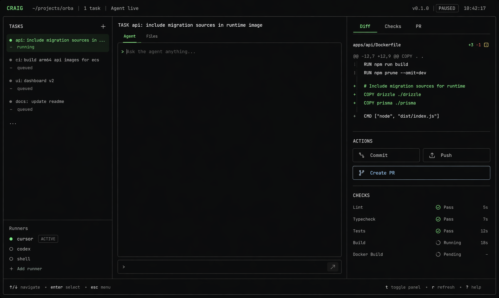
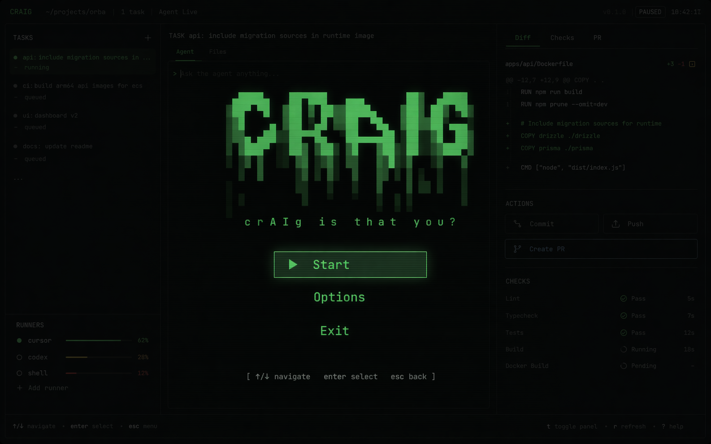

# RFC: Craig Multi-Repo Control Plane

- **Date:** 2026-04-23
- **Status:** In Flight
- **Author:** Codex
- **Supersedes:** 2026-04-20-rfc-craig-control-plane.md

---

## Context and goals

Craig should no longer be planned as a repo-local shell that gradually becomes a TUI. The product direction is a workspace-native control plane for agent-driven development across multiple repositories, with each task represented as a durable execution unit that Craig can launch, supervise, inspect, review, and clean up.

The current implementation proved some useful scaffolding around local state, worktrees, task records, and interactive control flow. It also exposed the limits of the prior architecture:

- the repo root is treated as the control-plane boundary instead of one workspace containing multiple repos
- `tmux` is carrying too much architectural weight for session lifecycle, restore, and navigation
- the runner strategy started from Cursor-first assumptions that no longer match the desired product
- the existing rollout order optimizes around a CLI-to-TUI transition instead of the intended mission-control product

The rewrite in this RFC makes four explicit product decisions:

- Craig is multi-repo from phase `1.1`
- Craig owns the session contract and PTY lifecycle through a Craig-controlled `SessionManager`
- Codex is the first runner vertical slice
- the current codebase is bootstrap context, not a baseline the design must preserve

The workflow problems this RFC is meant to solve are:

- agent work is fragmented across multiple repos, worktrees, terminals, and review surfaces
- it is hard to resume the exact state of in-flight tasks after closing the terminal or switching context
- branch, worktree, and execution-session setup are still too manual
- review readiness, diffs, CI state, and next actions are not visible in one place
- input ownership is often ambiguous when switching between control UI and raw terminal interaction
- file inspection and editing feel like leaving the product rather than being a controlled handoff

Goals for this RFC:

- establish Craig as the local control plane for one workspace containing many repos
- make workspaces first-class durable objects that can be archived and later restored
- make `task = worktree = session-backed execution unit` the primary mental model
- support the full developer loop inside Craig: register repo, create task, launch runner, inspect, review, check, commit, PR, merge, and cleanup
- keep durable state local under one workspace-scoped `.craig/`
- make the Craig session contract primary and keep any durable session substrate, including `tmux`, behind `SessionManager` as an implementation detail
- make Craig-controlled input the default, with explicit transitions into terminal attach and `nvim`
- ship the mission-control interaction model early rather than as a late-phase embellishment
- validate the control-plane architecture with Codex first and add other runners only after the core contracts are proven

## Non-goals

- hosted sync, cloud state, or multi-user collaboration
- team features, shared presence, or multiplayer task ownership
- Claude Code support in this RFC
- a generic runner marketplace or overly abstract runner plugin system
- building a full editor inside Craig
- allowing runner switching after a task has already started
- preserving `tmux` as part of the public product contract
- preserving the prior phase numbering or roadmap shape
- generalized non-repo jobs before the multi-repo repo-task product is proven
- replicating every Conductor-specific feature on day one if it would block the core workspace-task loop

## Proposal

Craig is a workspace-native local control plane. A workspace contains registered repos. A repo contains tasks. A task owns exactly one worktree and exactly one Craig-managed PTY session. The Craig UI owns navigation, orchestration, and input routing; terminal attachment and `nvim` handoff are explicit mode changes rather than the default operating state.

Craig is responsible for:

- workspace bootstrap and repo registration
- workspace archival, restore, and global workspace listing
- task lifecycle and worktree management
- PTY session creation, attachment, resize, and termination
- runner launch and supervision through a narrow adapter boundary
- state persistence and restore
- task inspection, review, and developer-loop actions
- UI selection, surface state, and input ownership

Craig uses external tools selectively:

- Git for repo and worktree operations
- Codex CLI for the phase `1.x` runner
- GitHub CLI for PR and merge flows when GitHub-backed review is in use
- `nvim` for deep file inspection and editing handoff
- a durable terminal substrate behind `SessionManager`, with `tmux` explicitly allowed in phase `1.x` if it is the most practical way to preserve live sessions across Craig restarts

Craig does not expose `tmux` as part of its public product contract. The user-facing model is always Craig task plus Craig session. Phase `1.x` may implement durable sessions with `tmux` under the hood, or another substrate later, so long as session creation, attach, restore, resize, and termination continue to flow through `SessionManager` and the persisted session contract defined by this RFC.

### Core abstractions

- `workspace`: one Craig root containing registered repos and shared state
- `repo`: one registered source repository inside the workspace
- `task`: one execution unit bound to exactly one repo, one branch, and one worktree
- `session`: one Craig-owned PTY-backed terminal session bound to exactly one task
- `surface`: one Craig UI context such as `agent`, `files`, `diff`, or `terminal`
- `archive`: a workspace state in which work is hidden from the active view but can later be restored with history and metadata intact

### Operating model

1. The user starts `craig` from the workspace root.
2. Craig loads or initializes workspace state under `.craig/`.
3. Craig restores the previously selected repo, task, and surface when still valid.
4. The user registers repos or selects an existing repo.
5. The user creates a task against one repo.
6. Craig creates the task record, branch, worktree, PTY session, and runner launch context.
7. Craig launches Codex in the new session and begins supervising task and session state.
8. The user navigates between Craig surfaces without losing control-plane context.
9. The user may explicitly attach to the live terminal session or open files in `nvim`.
10. Craig preserves orientation and restores the same task and surface on return.
11. Craig supports checks, commit, PR, merge, and cleanup inside the same task model.
12. When work is complete, the user archives the workspace and may restore it later from a global workspace list.

## System model

Craig has six layers:

1. Control plane: workspace lifecycle, task orchestration, command dispatch, and action routing
2. Workspace and repo model: repo registration, selection, worktree allocation, and repo-local metadata
3. Session layer: Craig-owned session lifecycle, PTY IO, resize, attach, snapshot, and termination over a durable substrate
4. Runner layer: Codex-first adapter contract with later runner expansion
5. State layer: workspace-scoped durable state and runtime restore data under `.craig/`
6. UI layer: task navigation, work surfaces, context panels, and explicit input ownership

Dependency direction should remain one-way:

- UI depends on control-plane services
- control-plane services depend on workspace, session, runner, and state services
- runner adapters depend on session primitives and repo/task context
- state services do not depend on UI or runner implementations

### Workspace and branch rules

- each workspace is identified primarily by its checked-out branch and secondarily by its directory name
- creating a new task-backed workspace creates a new branch immediately
- the first active task prompt may rename that branch to match the work more closely
- one branch may only be checked out by one active workspace at a time
- starting from an existing branch is allowed, but Craig must detect conflicts before attaching that branch to another active workspace
- archiving a workspace removes it from the active workspace list without deleting its history or durable metadata
- restoring a workspace must restore its branch association, persisted metadata, and prior chat or task history when still available

### Linked multi-repo context

Registering many repos in one workspace is not enough on its own. Craig should also support explicit linked-repo context so one task can inspect files from other registered repos without collapsing them into one filesystem root.

Phase `1.x` should define a Craig-native equivalent of linked directories:

- a task is still owned by exactly one primary `repoId`
- a task may declare zero or more linked repo ids for read-oriented context
- linked repos do not change the task's branch, worktree, PR target, or ownership model
- linked-repo access must be explicit in state and visible in the UI
- writes should default to the primary repo unless a later phase intentionally broadens that contract

## UI and interaction model

Craig should present a three-column mission-control surface from the first interactive vertical slice:

- left column: repos and tasks, including current selection and status
- middle column: the active Craig work surface where the user types commands, triggers actions, and confirms transitions
- right column: context tabs for task summary, logs, diff, files, and review status

The product must preserve explicit input ownership:

- `control` mode: Craig owns all keystrokes
- `attach` mode: the selected task session owns keystrokes
- transitions into `attach` mode are explicit
- transitions out of `attach` mode use a Craig-owned detach chord
- switching surfaces must not implicitly transfer input ownership

Surface rules:

- the selected task remains stable across refresh unless it becomes invalid
- the active surface remains stable across refresh unless it becomes invalid
- if restored selection is invalid, Craig falls back to the highest-priority actionable task in the selected repo, then to the first repo with actionable work
- logs, diff, and file views refresh in place without stealing focus
- `nvim` handoff must preserve the selected repo, task, and surface context on return when practical
- the UI should remain Craig-first even when the user temporarily drops into terminal or editor interaction

### Overlay and archive model

Craig has two top-level UI states:

- active mission-control state for normal work
- overlay state for start, pause, archive access, and top-level workspace actions

The overlay is the Craig-owned shell for:

- first boot
- explicit pause
- restore and archive browsing
- settings and setup actions

Archiving a workspace must move it out of the active task list without deleting its durable state. Restoring an archived workspace must return it to the active list and restore the most recent valid UI state.

### Keyboard and action model

The keyboard contract should be stable enough for muscle memory:

- `tab` and `shift-tab` move focus between left, middle, and right panels
- `j` and `k` or arrow keys move selection in the focused list
- `enter` activates the default action for the focused item
- `/` filters the current list or opens search
- `:` opens the command bar in the middle surface
- `a` opens task actions in the middle surface
- `d` opens diff context
- `f` opens files context
- `r` opens review or readiness context
- `t` enters explicit terminal attach mode for the selected task
- `esc` unwinds overlays and transient state before returning focus to the default control surface

### Guided review model

The diff and review surfaces should do more than render raw state. Craig should recommend the next action on the way to merge, such as:

- run setup
- run checks
- review diff
- create PR
- wait for CI
- merge
- archive

### Todos and checkpoints

Craig should treat manual merge readiness as a first-class feature, not only automated check status.

- each workspace may contain manual todos or notes that block merge readiness until checked off
- todos live alongside review state and are visible in the mission-control context surface
- Craig records automatic checkpoints at meaningful interaction boundaries so the user can inspect or revert recent turns
- restoring a checkpoint may revert both code and associated Craig-visible history after explicit confirmation

### Setup and run scripts

Craig should expose both setup scripts and run scripts as first-class workflow primitives:

- setup scripts prepare the workspace before active development, such as installing dependencies, bootstrapping services, or generating local config
- run scripts start one interactive test or app process from the workspace UI
- run scripts should support `$CONDUCTOR_PORT`-style port indirection or a Craig equivalent so multiple workspaces can run in parallel cleanly
- the RFC should keep room for root-mode or spotlight-style testing when running from the workspace directory is impractical

### Extensibility surfaces

Craig should preserve room for:

- slash-command style prompt shortcuts stored as repo-local or user-local Markdown commands
- MCP-backed external tool and data access through the runner surface
- deep-link actions that can create or focus workspaces from external tools

### Visual references

The following assets are part of this RFC and should be treated as visual reference points for implementation direction, not pixel-perfect mocks:

- Steady-state mission-control shell: `docs/rfcs/assets/craig-control-plane-shell.png`
- Boot and pause overlay treatment: `docs/rfcs/assets/craig-boot-overlay.png`

Shell reference:



Overlay reference:



## Implementation tracker

### Status summary

- `1.1` Workspace bootstrap, archive model, and repo registry: `implemented`
- `1.2` Task creation, linked repo context, and session execution: `pending`
- `1.3` Mission-control interaction shell: `pending`
- `1.4a` End-to-end developer loop with setup, run, check, PR, merge, and cleanup: `pending`
- `1.4b` Todos, checkpoints, and review guidance on top of the core loop: `pending`
- `2.1` Files, diff, right-context panels, and guided review: `pending`
- `2.2` `nvim` handoff, checkpoints, and review flow polish: `pending`
- `3.1` Cursor adapter, slash commands, and MCP expansion on the same contracts: `pending`
- `4.1` Optional non-repo jobs: `pending`

### Verification summary

- `1.1` Verified with workspace-scoped bootstrap, repo registry, workspace archive and restore, persisted UI restore state, overlay rendering, and updated command routing covered by `pnpm test`, `pnpm typecheck`, and `pnpm lint`.
- `1.2` Not yet verified under this superseding RFC. Prior worktree and runner launch behavior depends on repo-local assumptions and `tmux`-backed execution.
- `1.3` Not yet verified under this superseding RFC. Prior interactive control-surface work exists but does not satisfy the multi-repo and native-PTY ownership requirements.
- `1.4a` Not yet verified under this superseding RFC. Prior developer-loop flows exist only on the old task and session model.
- `1.4b` Not yet verified under this superseding RFC. Prior todo, checkpoint, and review-guidance behavior does not exist on the new workspace model.
- `2.1` Not yet verified.
- `2.2` Not yet verified.
- `3.1` Not yet verified.
- `4.1` Not yet verified.

### Next resume point

Resume at the first sub-phase that is not both implemented and verified. The current resume point is `1.2`.

### Deferred phases

- `3.1` Deferred until the Codex-first control-plane and session contracts are stable enough to validate a second runner without architectural drift.
- `4.1` Deferred until the workspace, repo, task, and review product is proven and still leaves room for generalized jobs without distorting the core design.

### Phase execution and verification policy

Each sub-phase is complete only when:

- its in-scope implementation items are landed coherently on the new workspace-scoped architecture
- automated tests covering the changed contracts pass
- the documented end-to-end flows for that sub-phase are exercised when practical
- out-of-scope failures and temporary compatibility gaps are recorded explicitly in this tracker

Every implementation session must resume from the first sub-phase that is not both implemented and verified. Compatibility shims that preserve pieces of the old architecture do not count as completion unless they satisfy the new contracts defined in this RFC.

## API and data model changes

There is no network API in this RFC. The external contract is the Craig CLI, the interactive mission-control surface, and the workspace state model.

### CLI contract

- `craig`
- `craig repo add <path>`
- `craig repo list`
- `craig repo remove <repo-id>`
- `craig workspace list [--archived]`
- `craig workspace archive <workspace-id>`
- `craig workspace restore <workspace-id>`
- `craig task new --repo <repo-id> "<prompt>"`
- `craig task list [--repo <repo-id>]`
- `craig task show <task-id>`
- `craig task logs <task-id>`
- `craig task diff <task-id>`
- `craig task open <task-id>`
- `craig task attach <task-id>`
- `craig task check <task-id>`
- `craig task commit <task-id>`
- `craig task pr <task-id> [--watch]`
- `craig task merge <task-id> [--preserve-worktree]`
- `craig task todo add <task-id> "<text>"`
- `craig task todo list <task-id>`
- `craig task checkpoint list <task-id>`
- `craig task checkpoint restore <task-id> <checkpoint-id>`
- `craig script setup <repo-id> [<name>]`
- `craig script run <repo-id> <name>`
- `craig link add <task-id> <repo-id>`
- `craig link list <task-id>`

Interactive mode should surface the same underlying actions as command mode. The command names may render differently inside the UI, but they must dispatch through the same service layer and persist the same state transitions.

### Core service contracts

#### `WorkspaceStore`

Responsible for loading, initializing, versioning, archiving, restoring, and atomically persisting workspace-scoped state under `.craig/`.

#### `RepoRegistry`

Responsible for registering, listing, validating, selecting, and removing repos known to the workspace. `repo remove` is blocked while any task records still reference that repo. Users must clean up or archive those tasks first so Craig never silently orphans task, session, artifact, or worktree state.

#### `TaskStore`

Responsible for creating, loading, updating, querying, checkpointing, archiving, and deleting task records across all repos in the workspace.

#### `SessionManager`

Responsible for Craig-owned session lifecycle over a durable terminal substrate:

- `create(task, context)`
- `attach(sessionId, io)`
- `resize(sessionId, size)`
- `write(sessionId, data)`
- `read(sessionId)`
- `terminate(sessionId, reason)`
- `snapshot(sessionId)`

`SessionManager` is the only layer allowed to know whether the underlying implementation is direct PTY ownership, `tmux`, or another durable session mechanism. Higher layers must depend only on the Craig session contract.

Phase `1.x` explicitly allows `tmux` as the default durable substrate because Craig needs live-session continuity across restarts before investing in a custom broker. That does not change the public product model.

`snapshot` must provide enough state to restore orientation after Craig restarts, including process status, last-known terminal metadata, substrate identity, and any replayable tail buffer Craig chooses to persist. Restoring orientation after restart is required; reattachment to a live session is required only when the configured substrate actually preserved that session.

#### `RunnerAdapter`

Responsible for runner-specific launch and supervision:

- `prepare(task, context)`
- `launch(task, context)`
- `status(task, context)`
- `stop(task, context)`
- `collectArtifacts(task, context)`

Phase `1.x` includes only a Codex adapter. Future adapters must reuse the same task and session model.

#### `InputRouter`

Responsible for routing keystrokes between Craig control mode and explicit terminal attach mode. It owns the detach chord and must make input ownership inspectable by the UI.

#### `SurfaceStateStore`

Responsible for selected repo, selected task, active surface, transient overlays, per-task UI context, and restore metadata. `SurfaceStateStore` persisted in `.craig/runtime/ui-state.json` is the sole authority for UI restore and selection state. Task and session records may reference IDs used by the UI, but they must not duplicate authoritative UI-selection fields.

#### `ScriptRegistry`

Responsible for loading and running setup scripts and run scripts from workspace or repo-local configuration.

#### `TodoStore`

Responsible for merge-blocking todos and notes associated with a workspace or task.

#### `CheckpointStore`

Responsible for recording, listing, and restoring user-visible checkpoints tied to task history and code state.

#### `LinkRegistry`

Responsible for explicit linked-repo associations for tasks.

### State model and filesystem layout

Craig state is workspace-scoped:

```text
.craig/
  index.json
  repos/
    <repo-id>.json
  workspaces/
    <workspace-id>.json
  tasks/
    <task-id>.json
  sessions/
    <session-id>.json
  checkpoints/
    <task-id>/
      <checkpoint-id>.json
  runtime/
    ui-state.json
  logs/
    <task-id>.log
  artifacts/
    <task-id>/
      pr-status.json
      check-summary.json
      review-notes.md
  worktrees/
    <repo-id>/
      <task-id>/
```

State model decisions locked by this RFC:

- one workspace-scoped `.craig/` is the source of truth
- workspaces are first-class records with active or archived state
- repos are first-class records rather than implicit cwd assumptions
- sessions are first-class records rather than fields hidden inside task state only
- UI restore state is explicit, versioned, and authoritative only in `runtime/ui-state.json`
- task records point to artifacts and sessions instead of embedding all volatile session state inline
- manual todos are first-class merge-readiness state
- checkpoints are first-class recoverability state
- writes to JSON state must be atomic

### Record contracts

Representative repo record:

```json
{
  "id": "repo_app",
  "name": "app",
  "rootPath": "/workspace/app",
  "defaultBranch": "main",
  "vcs": {
    "provider": "git"
  },
  "createdAt": "2026-04-23T20:00:00Z",
  "updatedAt": "2026-04-23T20:00:00Z"
}
```

Representative workspace record:

```json
{
  "id": "workspace_auth_rewrite",
  "primaryRepoId": "repo_app",
  "branch": "auth-rewrite",
  "status": "active",
  "linkedRepoIds": ["repo_docs"],
  "archivedAt": null,
  "createdAt": "2026-04-23T20:00:00Z",
  "updatedAt": "2026-04-23T20:00:00Z"
}
```

Representative task record:

```json
{
  "id": "task_20260423_01",
  "repoId": "repo_app",
  "title": "rewrite auth middleware",
  "slug": "rewrite-auth-middleware",
  "status": "running",
  "runner": "codex",
  "workspaceId": "workspace_auth_rewrite",
  "branch": "craig/task_20260423_01",
  "worktreePath": "/workspace/.craig/worktrees/repo_app/task_20260423_01",
  "sessionId": "session_20260423_01",
  "linkedRepoIds": ["repo_docs"],
  "artifacts": {
    "logPath": ".craig/logs/task_20260423_01.log",
    "checkSummaryPath": ".craig/artifacts/task_20260423_01/check-summary.json",
    "prStatusPath": ".craig/artifacts/task_20260423_01/pr-status.json"
  },
  "createdAt": "2026-04-23T20:01:00Z",
  "updatedAt": "2026-04-23T20:01:00Z"
}
```

Representative runtime UI state:

```json
{
  "version": 1,
  "selectedRepoId": "repo_app",
  "selectedTaskId": "task_20260423_01",
  "activeSurface": "agent",
  "perTaskContext": {
    "task_20260423_01": {
      "lastContextTab": "summary"
    }
  },
  "updatedAt": "2026-04-23T20:01:10Z"
}
```

Representative todo state:

```json
{
  "taskId": "task_20260423_01",
  "items": [
    {
      "id": "todo_review_copy",
      "text": "Review docs copy before merge",
      "completed": false
    }
  ]
}
```

Representative session record:

```json
{
  "id": "session_20260423_01",
  "taskId": "task_20260423_01",
  "pty": {
    "cols": 160,
    "rows": 48
  },
  "process": {
    "pid": 12345,
    "startedAt": "2026-04-23T20:01:05Z",
    "lastKnownState": "running",
    "exitCode": null,
    "exitedAt": null
  },
  "restore": {
    "tailBufferPath": ".craig/runtime/session_20260423_01.tail"
  },
  "createdAt": "2026-04-23T20:01:05Z",
  "updatedAt": "2026-04-23T20:01:05Z"
}
```

## Edge cases and failure modes

- repo path missing at startup: mark the repo unavailable, keep its record, and prevent new tasks until the path is restored or the repo is removed explicitly
- explicit `repo remove`: block removal while any task records for that repo still exist so Craig never silently orphans worktrees, sessions, or artifacts
- workspace archive while tasks are live: archive must preserve history and metadata, but active terminal attach must be exited first
- restored selected repo or task missing: fall back deterministically and persist the repaired selection
- worktree deleted out of band: surface the task as degraded and block actions that require the missing path
- PTY process exits unexpectedly: mark the session dead, preserve logs, and offer inspect, relaunch, or cleanup actions as appropriate
- terminal resize while attached: propagate the new size through `SessionManager.resize` without changing task or surface selection
- Craig restarts while tasks are live: restore UI state from persisted records and session snapshots without implicitly reattaching input
- invalid review actions: block PR, merge, or cleanup when prerequisite task state is missing, stale, or failed
- cross-repo state bleed: repo selection, task filtering, worktree paths, and artifact paths must remain namespaced by `repoId`
- linked repos must not silently broaden write scope beyond the primary repo contract
- checkpoint restore must clearly communicate when later chat or task history will be discarded
- `nvim` return path fails: return to the default Craig surface for the same task and record the degraded handoff in logs or runtime state

## Security and privacy

- all Craig state remains local on disk under the workspace
- Craig inherits credentials from the local environment and configured CLIs rather than copying secrets into its own state
- logs and artifacts may contain sensitive code, prompts, and review data; they must stay local unless the user explicitly opens a PR or exports them
- session management must not expose PTY handles across tasks
- attach and write operations must verify `sessionId -> taskId -> selected task` before routing input
- repo registration should validate that paths are local filesystem paths and not silently follow ambiguous or missing targets
- Craig should avoid persisting raw terminal history beyond what is required for restore and inspection
- checkpoint restore must require explicit confirmation because it may destroy later code and conversation state

## Observability

Craig should emit enough structured local telemetry for debugging and restore without introducing a hosted analytics dependency.

At minimum, persist or surface:

- workspace initialization and schema-version events
- workspace archive and restore events
- repo registration, validation failure, and removal events
- task lifecycle transitions
- session create, attach, resize, terminate, and unexpected-exit events
- runner launch and status transitions
- setup-script and run-script execution events
- todo state changes and merge-block events
- checkpoint creation and restore events
- linked-repo add and remove events
- restore decisions for selected repo, selected task, and active surface
- user-visible action failures for checks, PRs, merges, cleanup, and editor handoff

Observability should be local-first:

- append-only log files for task and session activity
- durable action summaries for checks and PR state
- concise runtime traces for restore and UI routing decisions

## Rollout plan

### Phase 1: Multi-repo Codex MVP

#### 1.1 Workspace bootstrap, archive model, and repo registry

Deliver workspace initialization, repo registration, workspace-scoped state, overlay boot flow, archive and restore primitives, branch identity rules, and persisted restore metadata for repo and task selection.

#### 1.2 Task creation, linked repo context, and session execution

Deliver per-repo task creation, branch and worktree provisioning, linked-repo context, Craig-owned session creation through `SessionManager`, Codex launch, and durable workspace plus task plus session records.

#### 1.3 Mission-control interaction shell

Deliver the three-column control surface, Craig-controlled default input, overlay state, explicit attach and detach, selected repo and task persistence, and live task plus session visibility.

#### 1.4a End-to-end developer loop with setup, run, check, PR, merge, and cleanup

Deliver inspect, logs, diff, setup scripts, run scripts, checks, commit, PR, merge, and cleanup on the new multi-repo task model.

#### 1.4b Todos, checkpoints, and review guidance on top of the core loop

Deliver merge-blocking todos, checkpoint creation and restore, and guided next-action review state on top of the stable core developer loop.

### Phase 2: Review and file navigation

#### 2.1 Files, diff, right-context panels, and guided review

Deliver file tree navigation, changed-file navigation, diff summary, stable right-context tabs, guided next actions, and preserved orientation across refresh.

#### 2.2 `nvim` handoff, checkpoints, and review flow polish

Deliver explicit editor handoff, checkpoint UX, return-to-context behavior, review readiness indicators, and calm refresh and performance behavior.

### Phase 3: Runner expansion

#### 3.1 Cursor adapter, slash commands, and MCP expansion on the same contracts

Add a Cursor adapter plus slash-command and MCP-facing workflow affordances only after the Codex-first task, session, and control-plane contracts are stable and proven.

### Phase 4: Optional generalized jobs

#### 4.1 Non-repo jobs only if still desired

Consider generalized jobs only if the core workspace-repo-task product is solid and the extension does not distort the main control-plane model.

## Plan Mode handoff checklist and acceptance criteria

### 1.1 Handoff

#### Implementation

- add workspace bootstrap separate from repo-local bootstrap assumptions
- add repo registry state, repo ids, and repo validation rules
- add workspace records with active and archived state
- define branch identity and one-workspace-per-branch constraints
- move Craig state ownership to one workspace-scoped `.craig/`
- implement boot overlay and restoreable selection metadata for repo, task, and surface state
- add migration or incompatibility handling for prior repo-local state if encountered
- make `runtime/ui-state.json` the sole authoritative UI restore store

#### Verification

- run automated coverage for workspace initialization, repo registration, and restore-state persistence
- manually verify first boot with no `.craig/`
- manually verify adding at least two repos, restarting Craig, and restoring the previous repo selection safely
- manually verify archiving and restoring a workspace preserves branch identity and history

#### Tracking update

- mark `1.1` implemented and verified only when workspace-scoped state, repo registry, and restore behavior all work together
- if compatibility with old repo-local state is partial, record the exact limitation explicitly in the tracker

### 1.2 Handoff

#### Implementation

- implement task creation against a selected `repoId`
- create repo-scoped worktree paths under workspace state
- implement optional linked repo ids for task context
- implement Craig-owned sessions through `SessionManager`, using a durable substrate such as `tmux` in phase `1.x` if needed
- implement the Codex runner adapter using the new `RunnerAdapter` contract
- persist first-class workspace, task, and session records linked by `sessionId`

#### Verification

- run automated coverage for task creation, session creation, and record persistence
- manually verify creating tasks in two repos in one workspace without cross-repo state bleed
- manually verify Codex launches in the correct worktree and the selected task can be restored after Craig restart, with live reattach working when the chosen substrate preserved the session
- manually verify linked repos are visible for context without changing write ownership

#### Tracking update

- keep `1.2` open if higher layers still depend directly on `tmux` semantics or repo-local cwd assumptions
- record any native-PTY portability limitations explicitly

### 1.3 Handoff

#### Implementation

- implement the three-column mission-control shell on the new workspace model
- make Craig-controlled input the default at startup and during normal navigation
- implement overlay entry for start, pause, archive access, and top-level workspace actions
- implement explicit attach mode and a Craig-owned detach chord
- persist selected repo, selected task, active surface, transient surface state, and per-task UI context in `SurfaceStateStore`
- surface live task and session status without forcing users into raw terminal mode

#### Verification

- run renderer or interaction coverage where practical
- manually verify switching between `agent`, `files`, `diff`, and `terminal` surfaces without implicit input-ownership changes
- manually verify explicit attach, terminal interaction, and Craig-owned detach returning to the same task and surface
- manually verify overlay open and close behavior does not lose task orientation

#### Tracking update

- keep `1.3` open if refresh, restore, or surface switching changes input ownership implicitly
- record any UI limitations around restore stability or large-workspace performance

### 1.4a Handoff

#### Implementation

- implement `show`, `logs`, `diff`, setup scripts, run scripts, `check`, `commit`, `pr`, `merge`, and cleanup on the new task model
- ensure all developer-loop actions resolve `repoId`, `taskId`, `worktreePath`, and `sessionId` correctly
- persist check results, PR state, merge readiness, and cleanup metadata under workspace-scoped artifacts
- block invalid transitions such as merge before green checks or actions against degraded tasks

#### Verification

- run automated coverage for lifecycle transitions and action gating
- manually execute the full flow from task creation to PR watch to merge and cleanup from the selected task
- manually verify degraded-state handling for missing repo path, missing worktree, or dead session
- manually verify setup scripts and run scripts from the workspace UI

#### Tracking update

- keep `1.4a` open until the normal repo-task workflow no longer depends on ad hoc shell steps
- record any provider-specific assumptions, such as GitHub CLI requirements or repo-removal blocking semantics, explicitly

### 1.4b Handoff

#### Implementation

- implement merge-blocking todos on top of the stable task and review state model
- implement user-visible checkpoint listing and restore flows
- add guided next-action recommendations that derive from checks, todos, PR state, and merge readiness
- ensure checkpoint restore and todo state changes integrate cleanly with the existing workspace, task, and surface model

#### Verification

- run automated coverage for todo state, merge blocking, checkpoint restore, and guided-action derivation
- manually verify unresolved todos block merge readiness
- manually verify checkpoint restore requires confirmation and correctly reverts state
- manually verify guided next actions update correctly as checks, todos, and PR state change

#### Tracking update

- keep `1.4b` open until manual readiness state and guided review are both usable without ad hoc side channels
- record any destructive-restore limitations or review-guidance gaps explicitly

### 2.1 Handoff

#### Implementation

- add files and diff panels to the right-context model
- implement changed-file navigation and diff-summary navigation from the selected task
- keep context tabs stable and preserve orientation across refresh and selection changes
- make file and diff navigation one or two actions from the selected task
- refine guided next-action recommendations in diff and review surfaces after the `1.4b` base guidance model exists

#### Verification

- run coverage for file-selection and diff-summary state where practical
- manually verify moving from task selection to files and diff without losing repo or task context
- manually verify right-context tabs remain stable during refresh and task updates
- manually verify the richer file and diff surfaces preserve orientation while showing the guidance produced in `1.4b`

#### Tracking update

- keep `2.1` open if file and diff navigation still force a shell-style escape hatch for core inspection work
- record any performance issues for large diffs or large task lists

### 2.2 Handoff

#### Implementation

- add explicit `nvim` handoff from the current repo, task, and file context
- integrate `nvim` handoff and checkpoint flows cleanly so restore and return-to-context semantics do not conflict
- restore the user to the same review context when practical after `nvim` exits
- add review readiness indicators and next-action visibility in the control surface
- reduce redraw noise and keep refresh behavior calm under active task updates

#### Verification

- manually verify opening a file in `nvim` and returning to the same review context
- manually verify `nvim` return and checkpoint workflows both preserve or intentionally reset context in a predictable way
- manually verify review readiness and next-action cues remain accurate through check, PR, and merge transitions
- manually verify calm refresh behavior under live task updates

#### Tracking update

- keep `2.2` open if `nvim` handoff returns users to an unrelated task or surface
- record any OS-specific or terminal-specific handoff limitations explicitly

### 3.1 Handoff

#### Implementation

- add a Cursor adapter using the same `RunnerAdapter`, `SessionManager`, and task schema contracts
- add slash-command style prompt shortcuts and MCP-facing tool configuration on the same workspace model
- reuse the same workspace, repo, task, session, and artifact model
- add only the minimum runner-selection affordances required to pick Cursor for new tasks

#### Verification

- run adapter-level coverage for launch and status handling
- manually verify that adding Cursor does not require a second task schema or separate session lifecycle
- manually verify slash commands and MCP-backed workflows do not fork the workspace model

#### Tracking update

- keep `3.1` blocked if Cursor support requires lifecycle or state-model forks
- record any runner-specific capability differences as adapter limitations rather than control-plane changes

### 4.1 Handoff

#### Implementation

- define non-repo job schema only after validating it fits the workspace model
- reuse existing artifact, session, and UI concepts where they still map cleanly
- keep repo-task workflows first-class and undistorted

#### Verification

- run automated coverage for job persistence and scheduling only if this phase is pursued
- manually verify at least one non-repo job produces a durable artifact without regressing repo-task workflows

#### Tracking update

- record which repo-task assumptions had to be relaxed before marking this phase complete
- leave this phase deferred if it weakens the workspace-repo-task product

### Acceptance criteria

- `[1.1]` Running `craig` in a workspace with no prior state initializes workspace-scoped `.craig/` state and supports registering repos.
- `[1.1]` Repo registration, restart, and restore preserve the previously selected repo when still valid.
- `[1.1]` Workspaces can be archived and later restored without losing branch identity or durable history.
- `[1.2]` `craig task new --repo <repo-id> "<prompt>"` creates a durable task record, worktree, branch, PTY-backed session, and Codex launch context.
- `[1.2]` Creating tasks in two different repos within one workspace does not mix task state, worktrees, logs, or artifacts.
- `[1.2]` Craig can restore the selected task after restart without requiring implicit session attach, and can reattach only when the configured session substrate preserved a live session.
- `[1.2]` `repo remove <repo-id>` is blocked until no task records still reference that repo.
- `[1.2]` Linked repos can be attached for context without changing the task's primary repo ownership.
- `[1.3]` Craig presents a three-column mission-control shell with Craig-owned input by default.
- `[1.3]` Switching between `agent`, `files`, `diff`, and `terminal` surfaces does not implicitly transfer input ownership.
- `[1.3]` Explicit attach and Craig-owned detach return the user to the same task and surface context.
- `[1.4a]` Users can run setup scripts, run scripts, inspect, check, commit, open a PR, watch CI, merge, and clean up from the selected task on the new multi-repo model.
- `[1.4a]` Craig blocks invalid transitions against missing, degraded, or non-ready tasks.
- `[1.4b]` Users can manage merge-blocking todos and see guided next actions derived from checks, todos, and PR state.
- `[1.4b]` Users can inspect and restore checkpoints with explicit confirmation before destructive reverts.
- `[2.1]` Craig supports file and diff navigation from the selected task without forcing ad hoc shell navigation.
- `[2.1]` Right-context tabs remain stable and preserve orientation during refresh.
- `[2.1]` Diff and review surfaces recommend the next action toward merge based on checks, todos, and PR state.
- `[2.2]` Opening a file in `nvim` returns the user to the same review context when practical.
- `[2.2]` Review readiness indicators and refresh behavior remain accurate and calm during active task updates.
- `[3.1]` Adding Cursor does not require a second task schema, a second session model, or a second control-plane lifecycle.
- `[3.1]` Slash commands and MCP-backed tool access reuse the same workspace, task, and session model.
- `[4.1]` If generalized jobs ship, they reuse the core workspace model without weakening repo-task workflows.
